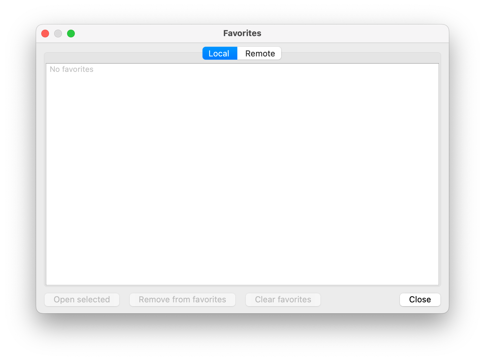
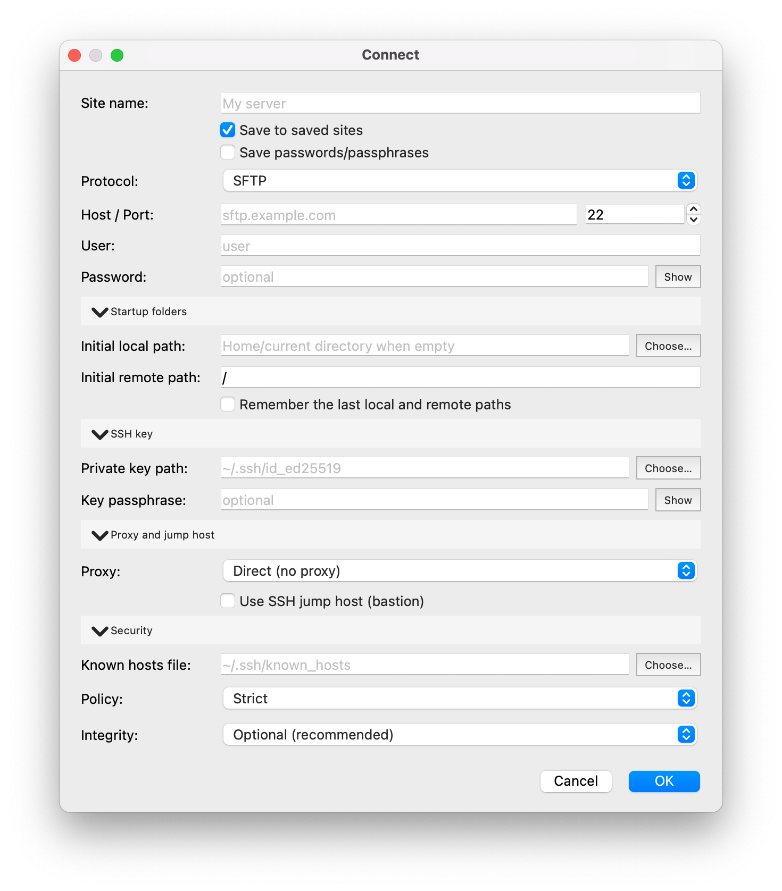

<div align="center">
  
  <h1>OpenSCP</h1>

  <p><strong>A lightweight, cross-platform file transfer client with a dual-panel workflow, secure defaults, and support for SFTP, SCP, FTP, FTPS, and WebDAV.</strong></p>
  <p><a href="README_ES.md">Leer en español</a></p>

  
</div>

OpenSCP is a C++20 and Qt 6 desktop application for moving and managing files
between local and remote systems. It focuses on predictable behavior, secure
defaults, and a familiar commander-style workflow.

## Download

Prebuilt binaries for every tagged release are on the
[Releases page](https://github.com/luiscuellar31/openscp/releases/latest).

| Platform | File |
| --- | --- |
| macOS, Apple Silicon | `OpenSCP-<version>-arm64-UNSIGNED.dmg` |
| macOS, Intel | `OpenSCP-<version>-x86_64-UNSIGNED.dmg` |
| Linux, x86_64 | `OpenSCP-<version>-x86_64.AppImage` |
| Linux, ARM64 | `OpenSCP-<version>-aarch64.AppImage` |
| Linux, Flatpak bundle | `OpenSCP-x86_64.flatpak`, `OpenSCP-aarch64.flatpak` |

Every release ships a `SHA256SUMS.txt` covering all of the above. Download it
next to the file you picked and check them together:

```bash
shasum -a 256 -c SHA256SUMS.txt --ignore-missing  # macOS
sha256sum -c SHA256SUMS.txt --ignore-missing      # Linux
```

### Installing on macOS

Open the DMG and drag OpenSCP onto the Applications folder, then launch it from
Applications.

The first launch is blocked: macOS reports that it cannot check the app for
malicious software. That check is reserved for software signed with a paid
Apple Developer ID, and OpenSCP is not enrolled in that program, so every build
is flagged the same way regardless of what it contains. The published checksum
is what lets you verify the download instead.

To allow it, open **System Settings → Privacy & Security**, scroll down to the
Security section, click **Open Anyway** next to the message about OpenSCP, and
confirm. OpenSCP then starts normally, including after a restart. On macOS 12
and 13 the same setting lives in **System Preferences → Security & Privacy →
General**.

The equivalent from a terminal:

```bash
xattr -dr com.apple.quarantine /Applications/OpenSCP.app
```

Two consequences worth knowing about: on macOS 15 and later the older
Control-click → Open shortcut no longer works, so the Privacy & Security route
above is the only one in the interface; and because unsigned builds have no
stable identity, macOS asks for keychain permission again after each update
when OpenSCP reads your saved passwords.

### Installing on Linux

The AppImage needs no installation and runs on most distributions:

```bash
chmod +x OpenSCP-<version>-x86_64.AppImage
./OpenSCP-<version>-x86_64.AppImage
```

The Flatpak bundle integrates with the desktop and runs confined:

```bash
flatpak remote-add --user --if-not-exists flathub https://flathub.org/repo/flathub.flatpakrepo
flatpak install --user ./OpenSCP-x86_64.flatpak
flatpak run io.github.luiscuellar31.openscp
```

The Flathub remote is needed because the bundle depends on the KDE runtime.

## Build from source

OpenSCP currently supports Linux and macOS. A compatible Qt 6 installation,
CMake 3.22+, libssh2, and OpenSSL are required. libcurl enables optional FTP
and FTPS support; WebDAV also requires tinyxml2.

```bash
git clone https://github.com/luiscuellar31/openscp.git
cd openscp

# Linux
./scripts/linux.sh dev

# macOS
./scripts/macos.sh dev
```

For distribution-specific dependencies, manual build steps, packaging, and
troubleshooting, see [Building OpenSCP](docs/BUILDING.md).

## Highlights

- Local/remote dual-panel navigation with flat clickable paths, an Open
  Directory dialog, history, favorites, search, and drag-and-drop.
- SFTP and SCP through libssh2; optional FTP, FTPS, and WebDAV through libcurl.
- A persistent transfer queue with parallel workers, pause, resume, retry,
  conflict policies, bandwidth limits, and resumable `.part` files.
- Saved sites with Keychain on macOS and Secret Service/libsecret on Linux.
- Strict, accept-new, or explicitly disabled SSH host-key verification.
- SOCKS5, HTTP CONNECT, and SSH jump-host support where the protocol allows it.
- One-way synchronization with preview, filters, and optional checksum checks.
- Spanish, English, Portuguese, French, and German interfaces.

## Path navigation

Each panel presents its current location as one conventional path field. Click
any parent directory within the path to open it, or click the current directory
to open the Open Directory dialog. You can also use `Ctrl+L` (`Cmd+L` is
additionally supported on macOS) or the platform Open shortcut: `Ctrl+O` on
Linux and `Cmd+O` on macOS.

The dialog accepts a path directly and provides recent paths and the favorites
for the selected local panel or remote session. See
[Keyboard shortcuts](docs/KEYBOARD_SHORTCUTS.md) for the complete shortcut
reference and panel-specific behavior.

Protocol availability depends on how the application was packaged. Consult the
[protocol matrix](docs/PLATFORM_COMPATIBILITY.md#protocol-availability-by-build)
before selecting an artifact.

## Documentation

- [Building and packaging](docs/BUILDING.md)
- [Keyboard shortcuts](docs/KEYBOARD_SHORTCUTS.md)
- [Contributing and translations](CONTRIBUTING.md)
- [Architecture](docs/ARCHITECTURE.md)
- [Platform and protocol compatibility](docs/PLATFORM_COMPATIBILITY.md)
- [Security policy](SECURITY.md)
- [Licensing](docs/LICENSING.md)

## Runtime diagnostics

These optional environment variables are useful when diagnosing a problem:

- `OPENSCP_LOG_LEVEL=off|error|warn|info|debug`
- `OPENSCP_TRANSFER_INTEGRITY=off|optional|required`
- `OPENSCP_KNOWNHOSTS_PLAIN=1|0`
- `OPENSCP_FP_HEX_ONLY=1`
- `OPENSCP_ENV=dev|prod` selects the runtime environment
- `OPENSCP_LOG_SENSITIVE=1` permits sensitive diagnostic details only together
  with `OPENSCP_ENV=dev`
- `OPENSCP_ENABLE_INSECURE_FALLBACK=1` only when the build permits it

Sensitive logging is disabled by default and should only be used temporarily in
a controlled development environment.

## More screenshots

<p align="center">
  
  
  
</p>

<p align="center">
  
  
  
</p>

<details>
  <summary>Advanced connection options</summary>
  <p align="center">
    
  </p>
</details>

## Roadmap

- Finish and validate Windows support; the current Windows code is still
  experimental.
- Test WebDAV with a wider range of servers.
- Support interactive authentication and more enterprise proxy and SSH
  jump-host setups.
- Add a command palette and selectable themes.

## Releases and contributions

Tagged releases are published on the
[GitHub Releases page](https://github.com/luiscuellar31/openscp/releases).
`main` contains stable work and `dev` is the pull-request target.

Contributions are welcome. Read [CONTRIBUTING.md](CONTRIBUTING.md) before
opening a pull request. Report vulnerabilities privately as described in
[SECURITY.md](SECURITY.md).

OpenSCP is available under GPLv3-only or a commercial license. Third-party
components retain their own licenses; see [Licensing](docs/LICENSING.md) and
[third-party credits](docs/credits/CREDITS.md).
