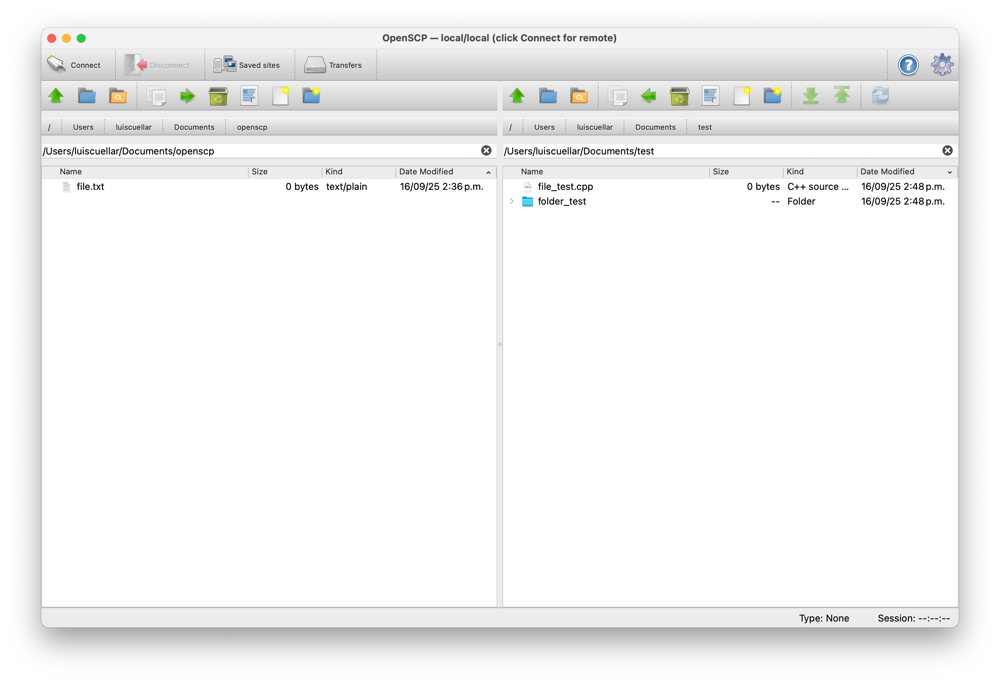
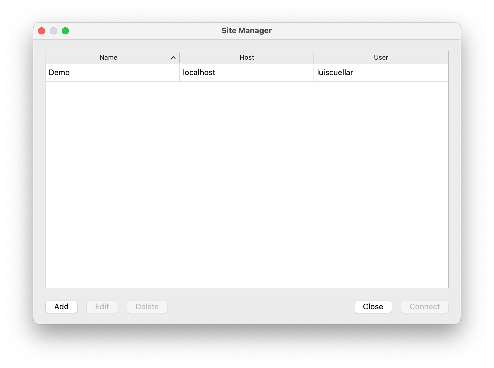
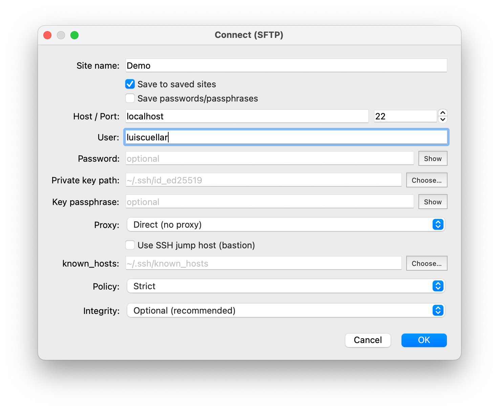
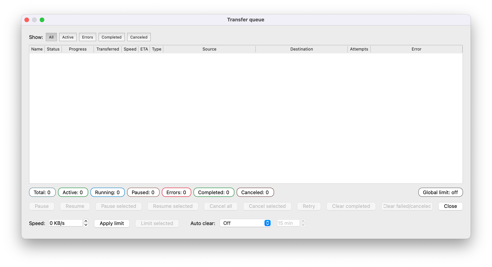

<div align="center">
    
    <h1 align="center">OpenSCP</h1>

<p>
    <strong>Cliente SFTP de doble panel enfocado en simplicidad y seguridad</strong>
</p>

<p>
    <a href="README.md"><strong>Read in English</strong></a>
</p>

<p>
    <strong>OpenSCP</strong> es un explorador de archivos estilo two-panel commander escrito en <strong>C++/Qt</strong>, con soporte <strong>SFTP</strong> (libssh2 + OpenSSL). Busca ser una alternativa ligera a herramientas como WinSCP, enfocada en <strong>seguridad</strong>, <strong>claridad</strong> y <strong>extensibilidad</strong>.
</p>

<br>



</div>

## Lanzamientos y Ramas

Versiones estables etiquetadas:
https://github.com/luiscuellar31/openscp/releases

- `main`: rama estable y probada
- `dev`: rama de desarrollo activo (destino de PRs)

## Inicio Rapido

```bash
git clone https://github.com/luiscuellar31/openscp.git
cd openscp
rm -rf build
cmake -S . -B build -DCMAKE_BUILD_TYPE=Release
cmake --build build -j

# Linux
./build/openscp_hello

# macOS
open build/OpenSCP.app
```

## Lo que Ofrece OpenSCP (v0.7.0)

### 1. Flujo de doble panel

- Navegacion independiente local/remoto.
- Copia y movimiento entre paneles con drag-and-drop.
- Operaciones remotas de contexto: descargar, subir, renombrar, eliminar, nueva carpeta/archivo y permisos.
- Breadcrumbs clicables y busqueda incremental por panel.

### 2. Motor de transferencias y cola

- Transferencias paralelas reales con conexiones aisladas por worker.
- Pausar/reanudar/cancelar/reintentar, limites por tarea/global y soporte de resume.
- UI de cola con porcentaje de progreso por fila, filtros y columnas detalladas (`Speed`, `ETA`, `Transferred`, `Error`, etc.).
- Acciones de contexto como reintentar seleccionadas, abrir destino, copiar rutas y politicas de limpieza.
- Persistencia de ventana/layout/filtro de la cola.

### 3. Endurecimiento de seguridad SFTP

- Auth: contrasena, clave privada (+passphrase), keyboard-interactive (OTP/2FA), ssh-agent.
- Politicas de host-key: `Strict`, `Accept new (TOFU)`, `No verification` (endurecida).
- Flujo endurecido para no-verificacion: doble confirmacion, excepcion temporal con TTL y banner de riesgo.
- Persistencia atomica de `known_hosts` y permisos POSIX estrictos (`~/.ssh` 0700, archivo 0600).
- Confirmacion explicita de conexion de una sola vez cuando falla persistir huella.
- Cancelacion segura en keyboard-interactive (sin fallback accidental de contrasena).
- Politica de integridad de transferencias (`off/optional|required`) con `.part` + finalize atomico.
- Redaccion de datos sensibles en logs de produccion por defecto.

### 4. Sitios guardados y credenciales

- Sitios guardados con identidad estable por UUID.
- Bloqueo de nombres de sitio duplicados.
- Flujos de renombrar/eliminar limpian secretos legacy o huerfanos.
- Eliminacion opcional de credenciales guardadas y entradas relacionadas en `known_hosts` al borrar sitios.
- Backends seguros:
    - macOS: Keychain
    - Linux: libsecret (si esta disponible)
- Feedback claro de persistencia en builds secure-only.
- Quick Connect puede guardar/actualizar datos del sitio sin duplicados.

### 5. Calidad de UX/UI

- Dialogo de conexion mejorado (campos mas claros, selectores inline para key/known_hosts, mostrar/ocultar contrasena).
- Ajustes redisenados en secciones `General` y `Advanced`.
- Ajustes mantiene los controles visibles al redimensionar (tamano minimo + paginas con scroll).
- Accion de un clic en Ajustes para restaurar layout/tamanos por defecto de la ventana principal.
- Dialogo de permisos con vista octal y presets comunes.
- Dialogo Acerca de con copia de diagnostico y mensajes fallback mas amigables.

### 6. Linea base de calidad (CI y tests)

- CI dividido por intencion:
    - push a `dev`: build rapido Linux + tests no integracion
    - PR a `main`: compuerta de integracion Linux y macOS
- En integracion CI se levanta un servidor SFTP temporal para pruebas end-to-end.
- Workflow nocturno con `ASan`, `UBSan`, `TSan` y `cppcheck`.

## Requisitos

- Qt `6.x` (probado con `6.8.3`)
- libssh2 (recomendado OpenSSL 3)
- CMake `3.22+`
- Compilador C++20

Opcional:

- macOS: Keychain (nativo)
- Linux: libsecret / Secret Service

## Probar Localmente

```bash
cmake -S . -B build -DOPEN_SCP_BUILD_TESTS=ON
cmake --build build --parallel
ctest --test-dir build --output-on-failure
```

`openscp_sftp_integration_tests` se omite si no defines variables de integracion:

- `OPEN_SCP_IT_SFTP_HOST`
- `OPEN_SCP_IT_SFTP_PORT`
- `OPEN_SCP_IT_SFTP_USER`
- `OPEN_SCP_IT_SFTP_PASS` o `OPEN_SCP_IT_SFTP_KEY`
- `OPEN_SCP_IT_SFTP_KEY_PASSPHRASE` (si aplica)
- `OPEN_SCP_IT_REMOTE_BASE`

## Flujos por Plataforma

### macOS

Bucle diario recomendado:

```bash
./scripts/macos.sh dev
```

Paso a paso:

```bash
./scripts/macos.sh configure
./scripts/macos.sh build
./scripts/macos.sh run
```

Empaquetado local sin firma:

```bash
./scripts/macos.sh app
./scripts/macos.sh pkg
./scripts/macos.sh dmg
./scripts/macos.sh dist
```

Si Qt esta fuera de la ruta por defecto (`$HOME/Qt/<version>/macos`):

```bash
export QT_PREFIX="/ruta/a/Qt/<version>/macos"
# o
export Qt6_DIR="/ruta/a/Qt/<version>/macos/lib/cmake/Qt6"
```

Detalles completos de empaquetado: `assets/macos/README.md`

### Linux

Detalles de build y empaquetado Linux (AppImage, Snap, Flatpak): `assets/linux/README.md`

## Variables de Entorno en Runtime

- `OPEN_SCP_KNOWNHOSTS_PLAIN=1|0` - fuerza hostnames planos vs hasheados en `known_hosts`.
- `OPEN_SCP_FP_HEX_ONLY=1` - muestra huellas en HEX con `:`.
- `OPEN_SCP_TRANSFER_INTEGRITY=off|optional|required` - sobrescribe la politica de integridad de transferencias.
- `OPEN_SCP_LOG_LEVEL=error|warn|info|debug` - ajusta la verbosidad de logs.
- `OPEN_SCP_ENV=dev|prod` - selector de entorno runtime (`dev` habilita diagnosticos solo de desarrollo).
- `OPEN_SCP_LOG_SENSITIVE=1` - habilita detalles sensibles de depuracion solo cuando `OPEN_SCP_ENV=dev` (apagado por defecto).
- `OPEN_SCP_ENABLE_INSECURE_FALLBACK=1` - habilita fallback inseguro solo cuando el build/plataforma lo soporta.

## Capturas

<p align="center">
    
    
    
</p>

## Roadmap

- El soporte para Windows esta planeado para futuras versiones.
- Protocolos: `SCP`, luego `FTP/FTPS/WebDAV`.
- Soporte de proxy y salto: `SOCKS5`, `HTTP CONNECT`, `ProxyJump`.
- Flujos de sincronizacion: comparar/sincronizar y keep-up-to-date con filtros/ignorados.
- Persistencia de cola entre reinicios.
- Mas UX: marcadores, historial, command palette y temas.

## Creditos y Licencias

- libssh2, OpenSSL, zlib y Qt pertenecen a sus respectivos autores.
- Textos de licencia: [docs/credits/LICENSES/](docs/credits/LICENSES/)
- Materiales Qt (LGPL): [docs/credits](docs/credits)

## Contribuir

- Las contribuciones son bienvenidas. Revisa `CONTRIBUTING.md` para flujo y estandares.
- Issues y pull requests son bienvenidos, especialmente en estabilidad macOS/Linux, i18n y robustez SFTP.
