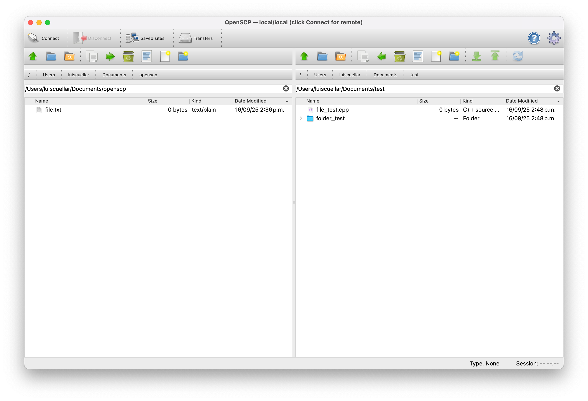
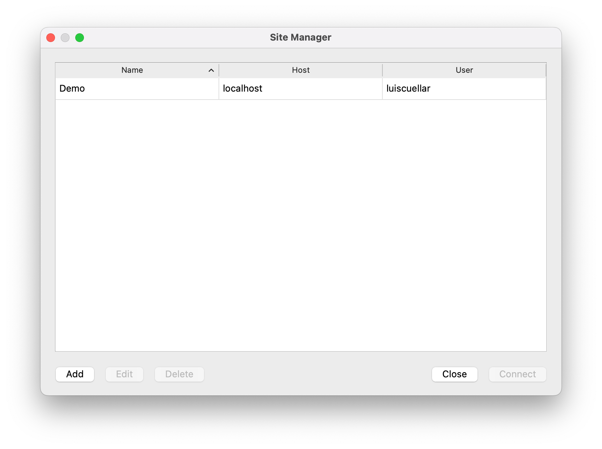
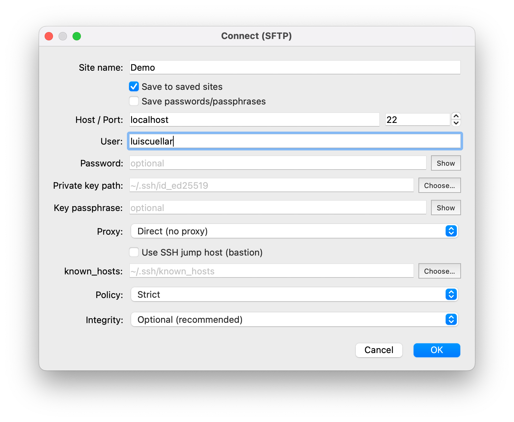
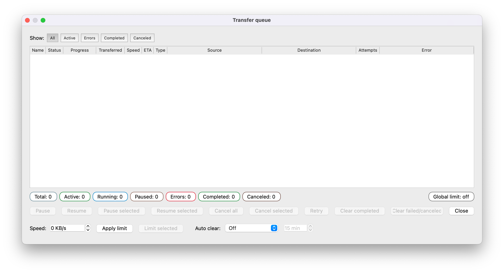

<div align="center">
    
    <h1 align="center">OpenSCP</h1>

<p>
    <strong>Cliente SFTP/SCP/FTP de doble panel enfocado en simplicidad y seguridad</strong>
</p>

<p>
    <a href="README.md"><strong>Read in English</strong></a>
</p>

<p>
    <strong>OpenSCP</strong> es un explorador de archivos estilo two-panel commander escrito en <strong>C++/Qt</strong>, con soporte <strong>SFTP</strong>, soporte inicial para <strong>SCP</strong> y soporte inicial para <strong>FTP</strong>. Busca ser una alternativa ligera a herramientas como WinSCP, enfocada en <strong>seguridad</strong>, <strong>claridad</strong> y <strong>extensibilidad</strong>.
</p>

<br>



</div>

## Lanzamientos y Ramas

Versiones estables etiquetadas:
https://github.com/luiscuellar31/openscp/releases

- `main`: rama estable y probada
- `dev`: rama de desarrollo activo (destino de PRs)

## Inicio Rapido

```bash
git clone https://github.com/luiscuellar31/openscp.git
cd openscp
rm -rf build
cmake -S . -B build -DCMAKE_BUILD_TYPE=Release
cmake --build build -j

# Linux
./build/openscp_hello

# macOS
open build/OpenSCP.app
```

## Lo que Ofrece OpenSCP (v0.9.0)

### 1. Flujo de doble panel

- Navegacion independiente local/remoto.
- Navegacion rapida con boton `Home` en las barras de panel (siempre en panel local izquierdo; en el panel derecho usa `HOME` en modo local y fallback a `/` en modo remoto).
- El panel derecho incluye `Open in terminal` en modo remoto para abrir una terminal SSH en la ruta remota actual usando el transporte activo (directo, proxy o jump host); si el shell SSH falla con error de sesion (por ejemplo PTY denegado), hace fallback automatico a `sftp` CLI en la misma terminal. Si ese transporte no se puede reproducir de forma segura, la app muestra un error explicito en lugar de degradar a un SSH directo basico. En Ajustes avanzados puedes forzar login interactivo (password/keyboard-interactive) para estos comandos.
- Copia y movimiento entre paneles con drag-and-drop.
- Operaciones remotas de contexto: descargar, subir, renombrar, eliminar, nueva carpeta/archivo y permisos.
- Breadcrumbs clicables y busqueda por panel (boton de barra o `Ctrl/Cmd+F`) con patrones wildcard/regex y modo recursivo opcional.
- El panel remoto usa deteccion de iconos por MIME (y proveedor nativo en macOS) para mayor paridad con iconos locales.

### 2. Motor de transferencias y cola

- Transferencias paralelas reales con conexiones aisladas por worker.
- Los prechecks costosos de cola se ejecutan fuera del hilo UI; fairness de scheduling y metricas de cola reducen starvation en alta concurrencia.
- Pausar/reanudar/cancelar/reintentar, limites por tarea/global y soporte de resume.
- Acciones de cola segun estado: los controles solo se habilitan cuando la seleccion/tarea permite la accion (por ejemplo, reintentar en `Error`/`Canceled`, reanudar en `Paused`).
- UI de cola con porcentaje de progreso por fila, filtros y columnas detalladas (`Speed`, `ETA`, `Transferred`, `Error`, etc.).
- Acciones de contexto como reintentar seleccionadas, abrir destino, copiar rutas y politicas de limpieza.
- Persistencia de ventana/layout/filtro de la cola.
- La barra de estado principal muestra avisos de transferencias completadas (subidas/descargas exitosas).
- Las transferencias usan sesiones de worker interrumpibles y tiempos de espera acotados de lectura/escritura en socket para evitar bloqueos indefinidos cuando la red se estanca.
- El flujo de finalizacion de subidas esta endurecido y las vistas remotas se refrescan de forma confiable al terminar uploads.
- Las operaciones remotas criticas ahora intentan una recuperacion automatica de sesion stale (reconexion + reintento) antes de fallar.
- La sesion remota principal se valida de forma periodica y al volver de suspension/bloqueo; si el transporte ya no es valido, OpenSCP se desconecta de forma segura con aviso claro.

### 3. Endurecimiento de seguridad de transporte SSH

- Auth: contrasena, clave privada (+passphrase), keyboard-interactive (OTP/2FA), ssh-agent.
- Selector de protocolo por sitio/sesion (`SFTP`, `SCP`, `FTP`).
- Politicas de host-key: `Strict`, `Accept new (TOFU)`, `No verification` (endurecida).
- El transporte por sitio puede usar TCP directo, proxy `SOCKS5` o tunel `HTTP CONNECT`.
- Se soporta tunel por sitio via SSH jump host (`ProxyJump`/bastion).
- La implementacion actual trata proxy y jump host como opciones mutuamente excluyentes por sesion.
- Flujo endurecido para no-verificacion: doble confirmacion, excepcion temporal con TTL y banner de riesgo.
- Persistencia atomica de `known_hosts` y permisos POSIX estrictos (`~/.ssh` 0700, archivo 0600).
- Confirmacion explicita de conexion de una sola vez cuando falla persistir huella.
- Cancelacion segura en keyboard-interactive (sin fallback accidental de contrasena).
- Politica de integridad de transferencias (`off/optional|required`) por sitio/sesion (y sobrescritura por variable de entorno) con `.part` + finalize atomico.
- Redaccion de datos sensibles en logs de produccion por defecto.

### 4. Sitios guardados y credenciales

- Sitios guardados con identidad estable por UUID.
- Los sitios guardados persisten por sitio el tipo/endpoint/usuario de proxy.
- Los sitios guardados persisten por sitio configuracion de jump host SSH (host/puerto/usuario/ruta de llave).
- Bloqueo de nombres de sitio duplicados.
- Flujos de renombrar/eliminar limpian secretos legacy o huerfanos.
- Eliminacion opcional de credenciales guardadas y entradas relacionadas en `known_hosts` al borrar sitios.
- Backends seguros:
    - macOS: Keychain
    - Linux: libsecret (si esta disponible)
- Las contrasenas de proxy se guardan en backend seguro (nunca en texto plano en ajustes del sitio).
- Feedback claro de persistencia en builds secure-only.
- Quick Connect puede guardar/actualizar datos del sitio sin duplicados.

### 5. Calidad de UX/UI

- Dialogo de conexion mejorado (campos mas claros, selectores inline para key/known_hosts, mostrar/ocultar contrasena).
- Dialogo de conexion con configuracion de proxy por sitio (`Direct`, `SOCKS5`, `HTTP CONNECT`) y auth opcional.
- Dialogo de conexion con configuracion opcional de SSH jump host (bastion) por sitio.
- Selector de idioma de la UI con `Ingles`, `Español` y `Portugués`.
- Ajustes redisenados en secciones `General` y `Advanced`.
- Ajustes mantiene los controles visibles al redimensionar (tamano minimo + paginas con scroll).
- Accion de un clic en Ajustes para restaurar layout/tamanos por defecto de la ventana principal.
- Dialogo de permisos con vista octal y presets comunes.
- Dialogo Acerca de con copia de diagnostico y mensajes fallback mas amigables.
- La ventana de cola de transferencias abre centrada respecto a la ventana principal.
- La barra de estado muestra el tipo de conexion activa y el tiempo transcurrido por sesion.
- El flujo de desconexion se mantiene responsivo: la UI vuelve de inmediato a modo local mientras la limpieza de transferencias puede continuar en segundo plano con watchdog/feedback.
- El reconectar se bloquea mientras la limpieza previa de transferencias siga en curso, evitando solapamientos de sesion.

### 6. Linea base de calidad (CI y tests)

- CI dividido por intencion:
    - push a `dev`: build rapido Linux + tests no integracion
    - PR a `main`: compuerta de integracion Linux y macOS
- En integracion CI se levanta un servidor SFTP temporal para pruebas end-to-end.
- La cobertura de integracion en PR valida variantes de transporte en CI: directo, tunel proxy `SOCKS5`, tunel proxy `HTTP CONNECT` (con auth) y tunel SSH jump host.
- El workflow de release por tag genera automaticamente notas de draft release desde Conventional Commits (`feat`, `fix`, `BREAKING CHANGE`, etc.).
- Workflow nocturno con `ASan`, `UBSan`, `TSan` y `cppcheck`.

## Requisitos

- Qt `6.x` (probado con `6.8.3`)
- libssh2 (recomendado OpenSSL 3)
- CMake `3.22+`
- Compilador C++20

Opcional:

- macOS: Keychain (nativo)
- Linux: libsecret / Secret Service
- Cliente OpenSSH (`ssh`) para tunel de jump host SSH.

## Probar Localmente

```bash
cmake -S . -B build -DOPEN_SCP_BUILD_TESTS=ON
cmake --build build --parallel
ctest --test-dir build --output-on-failure
```

`openscp_sftp_integration_tests` se omite si no defines variables de integracion:

- `OPEN_SCP_IT_SFTP_HOST`
- `OPEN_SCP_IT_SFTP_PORT`
- `OPEN_SCP_IT_SFTP_USER`
- `OPEN_SCP_IT_SFTP_PASS` o `OPEN_SCP_IT_SFTP_KEY`
- `OPEN_SCP_IT_SFTP_KEY_PASSPHRASE` (si aplica)
- `OPEN_SCP_IT_REMOTE_BASE`
- `OPEN_SCP_IT_PROXY_TYPE` (`socks5` o `http`, opcional)
- `OPEN_SCP_IT_PROXY_HOST` (requerido cuando `OPEN_SCP_IT_PROXY_TYPE` esta definido)
- `OPEN_SCP_IT_PROXY_PORT` (opcional; por defecto: `1080` para `socks5`, `8080` para `http`)
- `OPEN_SCP_IT_PROXY_USER` (opcional)
- `OPEN_SCP_IT_PROXY_PASS` (opcional)
- `OPEN_SCP_IT_JUMP_HOST` (opcional)
- `OPEN_SCP_IT_JUMP_PORT` (opcional; por defecto `22`)
- `OPEN_SCP_IT_JUMP_USER` (opcional)
- `OPEN_SCP_IT_JUMP_KEY` (opcional)

## Flujos por Plataforma

### macOS

Bucle diario recomendado:

```bash
./scripts/macos.sh dev
```

Paso a paso:

```bash
./scripts/macos.sh configure
./scripts/macos.sh build
./scripts/macos.sh run
```

Empaquetado local sin firma:

```bash
./scripts/macos.sh app
./scripts/macos.sh pkg
./scripts/macos.sh dmg
./scripts/macos.sh dist
```

Si Qt esta fuera de la ruta por defecto (`$HOME/Qt/<version>/macos`):

```bash
export QT_PREFIX="/ruta/a/Qt/<version>/macos"
# o
export Qt6_DIR="/ruta/a/Qt/<version>/macos/lib/cmake/Qt6"
```

Detalles completos de empaquetado: [assets/macos/README.md](assets/macos/README.md)

### Linux

Detalles de build y empaquetado Linux (AppImage, Snap, Flatpak): [assets/linux/README.md](assets/linux/README.md)

## Variables de Entorno en Runtime

- `OPEN_SCP_KNOWNHOSTS_PLAIN=1|0` - fuerza hostnames planos vs hasheados en `known_hosts`.
- `OPEN_SCP_FP_HEX_ONLY=1` - muestra huellas en HEX con `:`.
- `OPEN_SCP_TRANSFER_INTEGRITY=off|optional|required` - sobrescribe la politica de integridad de transferencias.
- `OPEN_SCP_LOG_LEVEL=off|error|warn|info|debug` - ajusta la verbosidad de logs.
- `OPEN_SCP_ENV=dev|prod` - selector de entorno runtime (`dev` habilita diagnosticos solo de desarrollo).
- `OPEN_SCP_LOG_SENSITIVE=1` - habilita detalles sensibles de depuracion solo cuando `OPEN_SCP_ENV=dev` (apagado por defecto).
- `OPEN_SCP_ENABLE_INSECURE_FALLBACK=1` - habilita fallback inseguro solo cuando el build/plataforma lo soporta.

## Capturas

<p align="center">
    
    
    
</p>

## Roadmap

- El soporte para Windows esta planeado para futuras versiones.
- Protocolos: `FTPS/WebDAV`.
- Flujos de autenticacion enterprise mas amplios para proxy/jump (por ejemplo, autenticacion jump interactiva fuera de modo batch).
- Flujos de sincronizacion: comparar/sincronizar y keep-up-to-date con filtros/ignorados.
- Persistencia de cola entre reinicios.
- Mas UX: marcadores, historial, command palette y temas.

## Creditos y Licencias

- libssh2, OpenSSL, zlib y Qt pertenecen a sus respectivos autores.
- Textos de licencia: [docs/credits/LICENSES/](docs/credits/LICENSES/)
- Materiales Qt (LGPL): [docs/credits](docs/credits)

## Contribuir

- Las contribuciones son bienvenidas. Revisa [CONTRIBUTING.md](CONTRIBUTING.md) para flujo y estandares.
- Issues y pull requests son bienvenidos, especialmente en estabilidad macOS/Linux, i18n y robustez SFTP/SCP/FTP.
