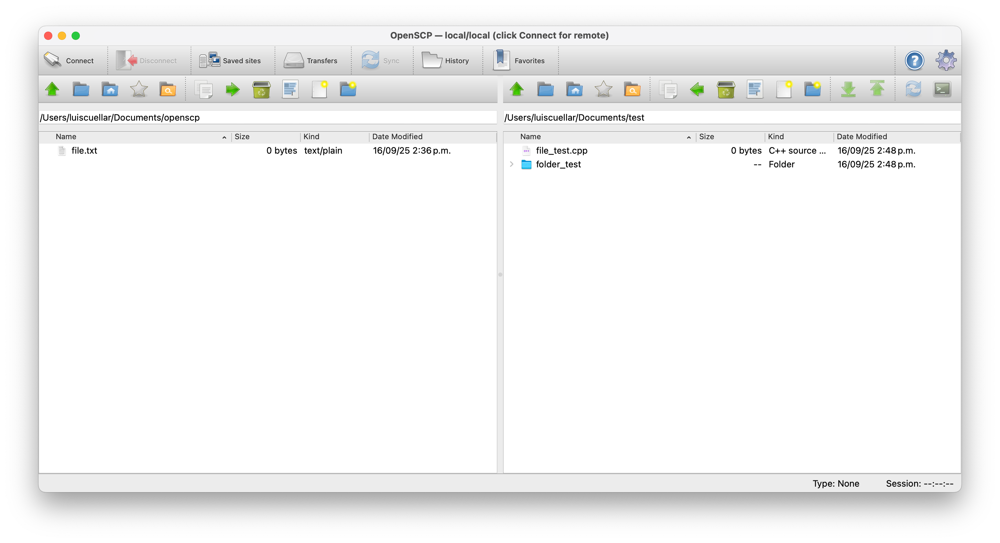
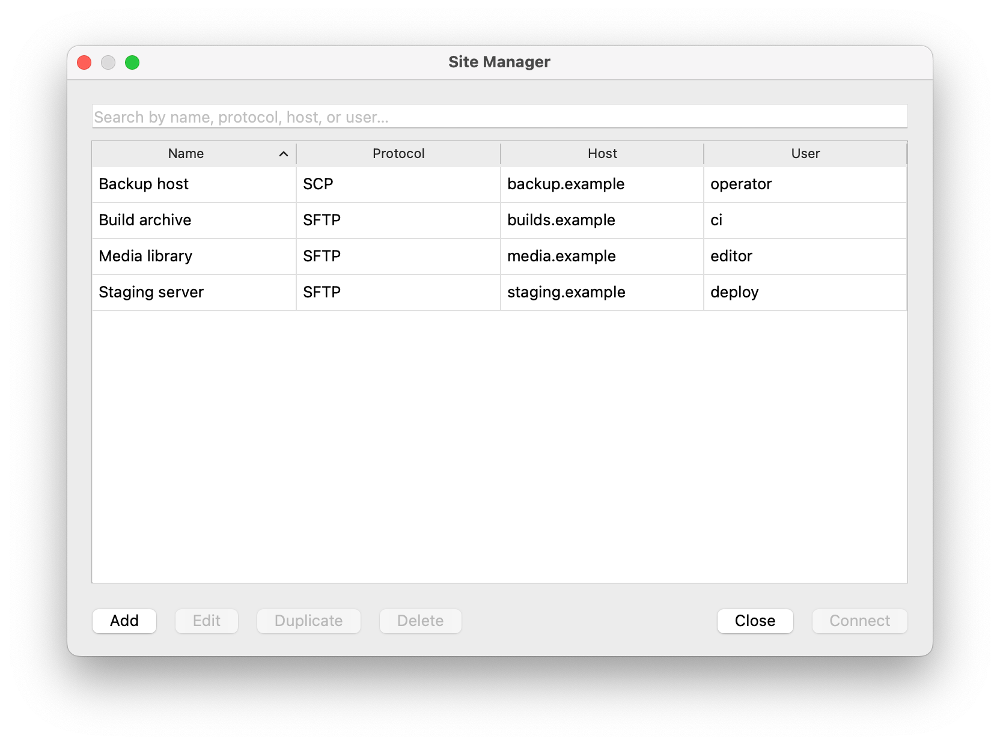
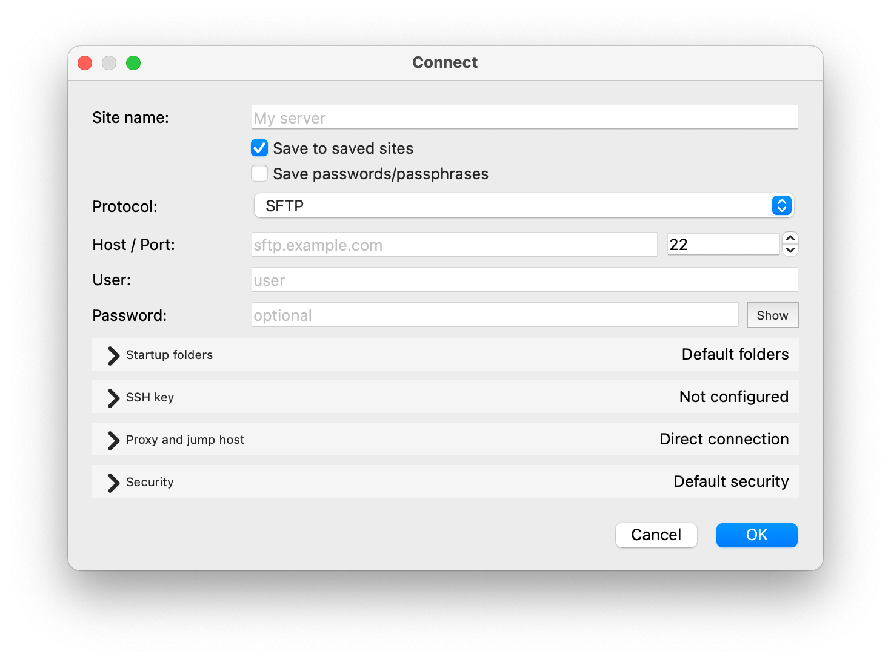
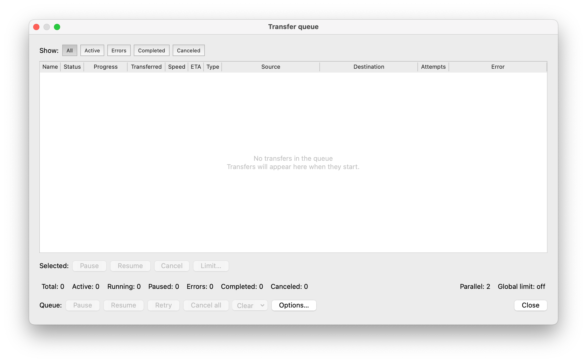
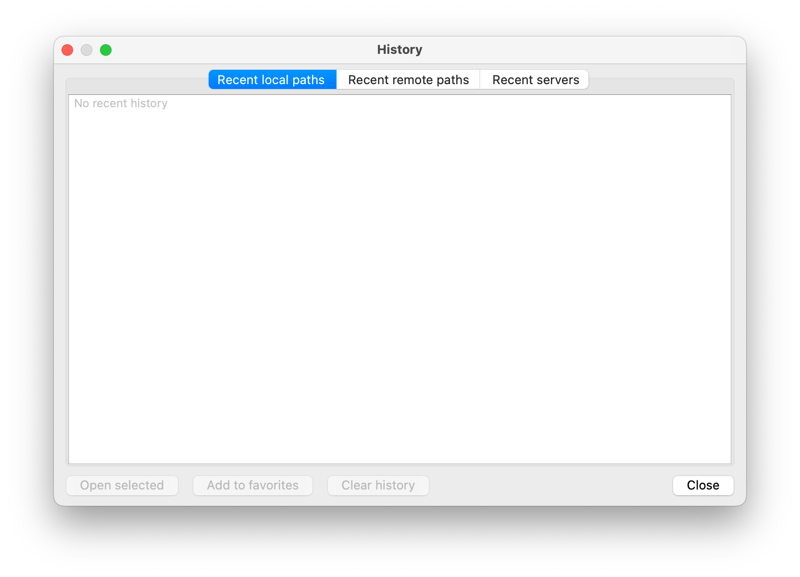
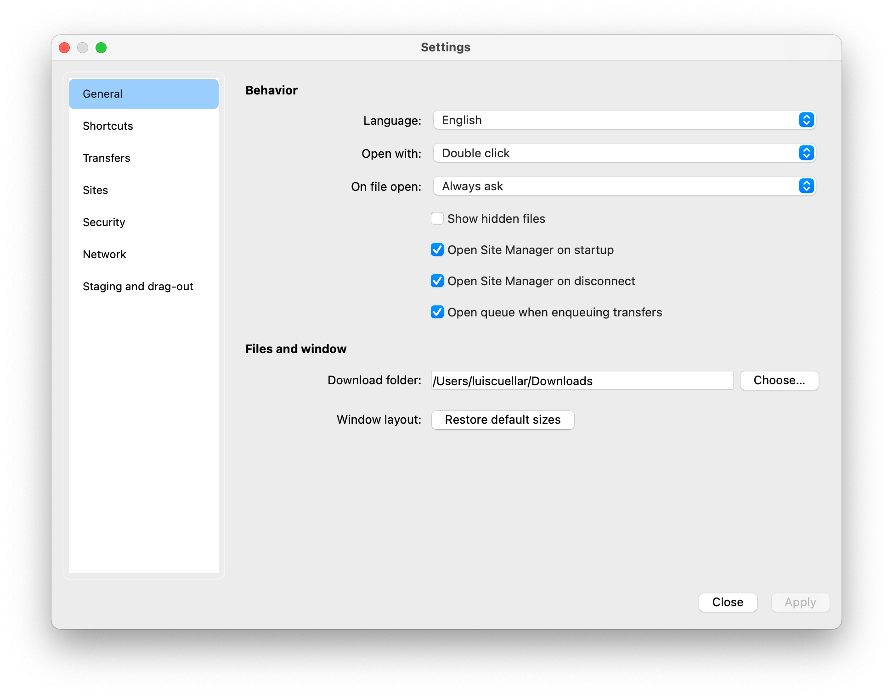

<div align="center">
  
  <h1>OpenSCP</h1>

  <p><strong>Un cliente ligero y multiplataforma de transferencia de archivos inspirado en WinSCP.</strong></p>
  <p><a href="README.md">Read in English</a></p>

  
</div>

OpenSCP es una aplicación de escritorio escrita en C++20 y Qt 6 para mover y
administrar archivos entre sistemas locales y remotos. Prioriza un
comportamiento predecible, configuraciones seguras y una interfaz familiar de
doble panel.

## Inicio rápido

OpenSCP es compatible actualmente con Linux y macOS. Requiere Qt 6, CMake
3.22+, libssh2 y OpenSSL. libcurl habilita FTP y FTPS; WebDAV requiere libcurl
y tinyxml2.

```bash
git clone https://github.com/luiscuellar31/openscp.git
cd openscp

# Linux
./scripts/linux.sh dev

# macOS
./scripts/macos.sh dev
```

Consulta [Compilar OpenSCP](docs/BUILDING.md) para dependencias por plataforma,
pasos manuales, empaquetado y solución de problemas.

## Características principales

- Navegación local y remota de doble panel con rutas navegables, historial,
  favoritos, búsqueda y la posibilidad de arrastrar y soltar.
- SFTP y SCP mediante libssh2; FTP, FTPS y WebDAV opcionales mediante libcurl.
- Cola persistente con transferencias en paralelo, pausa, reanudación,
  reintentos, políticas de conflicto, límites de ancho de banda y archivos
  `.part`.
- Sitios guardados con Keychain en macOS y Secret Service/libsecret en Linux.
- Verificación estricta de claves SSH, con aceptación de claves nuevas o
  deshabilitada explícitamente.
- Proxies SOCKS5 y HTTP CONNECT, además de servidores de salto SSH cuando el
  protocolo lo permite.
- Sincronización unidireccional con vista previa, filtros y sumas de
  comprobación opcionales.
- Interfaces en inglés, español, francés y portugués.

Los protocolos disponibles dependen del paquete. Consulta la
[matriz de protocolos](docs/PLATFORM_COMPATIBILITY.md#protocol-availability-by-build)
antes de elegir un paquete.

## Documentación

- [Compilación y empaquetado](docs/BUILDING.md)
- [Contribuciones y traducciones](CONTRIBUTING.md)
- [Arquitectura](docs/ARCHITECTURE.md)
- [Compatibilidad de plataformas y protocolos](docs/PLATFORM_COMPATIBILITY.md)
- [Política de seguridad](SECURITY.md)
- [Licenciamiento](docs/LICENSING.md)

## Diagnóstico en ejecución

Estas variables opcionales ayudan a diagnosticar problemas:

- `OPENSCP_LOG_LEVEL=off|error|warn|info|debug`
- `OPENSCP_TRANSFER_INTEGRITY=off|optional|required`
- `OPENSCP_KNOWNHOSTS_PLAIN=1|0`
- `OPENSCP_FP_HEX_ONLY=1`
- `OPENSCP_ENV=dev|prod` selecciona el entorno de ejecución
- `OPENSCP_LOG_SENSITIVE=1` permite detalles sensibles de diagnóstico solamente
  junto con `OPENSCP_ENV=dev`
- `OPENSCP_ENABLE_INSECURE_FALLBACK=1` solo cuando la compilación lo permite

Los registros sensibles están deshabilitados por defecto y solo deberían
activarse temporalmente en un entorno de desarrollo controlado.

## Más capturas

<p align="center">
  
  
  
</p>

<p align="center">
  
  
</p>

## Roadmap

- Completar y validar la compatibilidad con Windows; el código actual todavía
  es experimental.
- Probar WebDAV con una mayor variedad de servidores.
- Ampliar la autenticación interactiva y las configuraciones empresariales de
  proxies y servidores de salto SSH.
- Añadir una paleta de comandos y temas seleccionables.

## Lanzamientos y contribuciones

Las versiones publicadas están disponibles en
[GitHub Releases](https://github.com/luiscuellar31/openscp/releases).
`main` contiene el trabajo estable y `dev` recibe los pull requests.

Las contribuciones son bienvenidas. Lee [CONTRIBUTING.md](CONTRIBUTING.md)
antes de abrir un pull request. Reporta vulnerabilidades de forma privada como
indica [SECURITY.md](SECURITY.md).

OpenSCP está disponible bajo GPLv3-only o una licencia comercial. Los
componentes de terceros conservan sus propias licencias; consulta
[Licenciamiento](docs/LICENSING.md) y los
[créditos de terceros](docs/credits/CREDITS.md).
